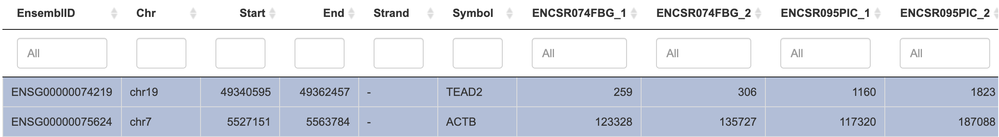
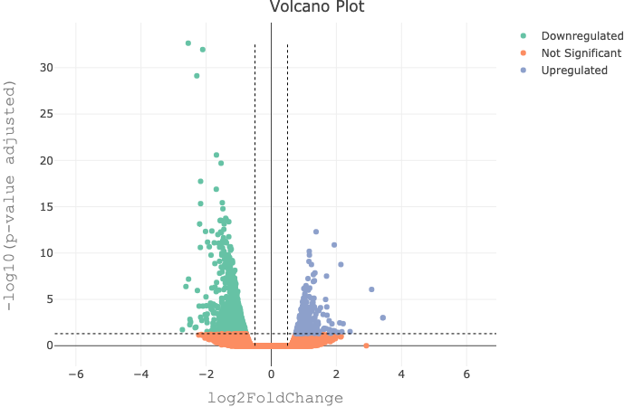
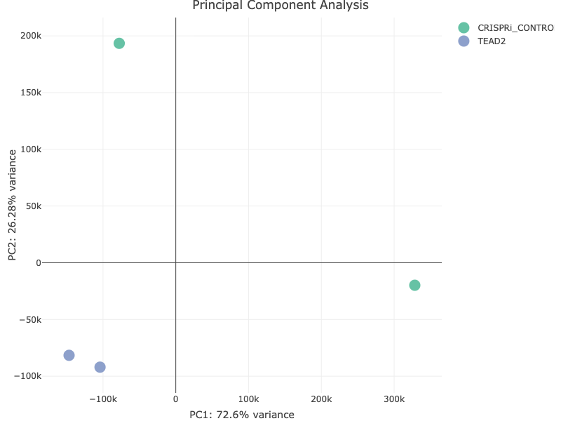

## Instructions {.tabset}

This exam is open book and open note.

Complete the following and send via email to <a href="mailto:dennis.hazelett@cshs.org">Prof. Hazelett</a> timestamped by 3 PM today (June 11, 2020). **Include your last name in the file name ( _e.g._ "HAZELETT_FINAL.html").** Use your assigned TF for all analyses unless otherwise indicated. _**If your factor has two batches associated, use batch A only**_. Submit your completed exam in html format. Make sure to review your work before submitting. Total points = 30.

```{r setup, include=FALSE}
Sys.getenv("HOME") # see where your home directory is
course_directory <- file.path(Sys.getenv("HOME"), "repos", "hgg_2020")
course_directory # double check what you set your course_directory to
knitr::opts_chunk$set(echo = TRUE)
knitr::opts_chunk$set(root.dir = course_directory)
```

<span style="color:red">Note that the answer key contains seperate tabs for each question.


### 1 {.tabset}

#### 1A
Using the TF assigned to you for this exam, generate the data and model files you need for differential expression analysis in GENAVi. Load the data into GENAVi, and using the raw counts table, select your target transcription factor and $\beta$-Actin (gene symbol: `ACTB`). Now, using _**the first of the two replicates**_ for knock-down and control and one of the enrichment methods we learned in class, answer the question: is your knockdown target differentially expressed (relative to $\beta$-Actin)? Show your work in the code block. **(3 pts)**

<span style="color:red">There are 3 steps to solving this problem. I will use TEAD2 factor as an example since everyone was working with a different transcription factor.</span>

<span style="color:red">Step 1) extract the count data for both genes from your treatment and control samples.</span>

<span style="color:red">Using code from assignment 1, extract a count matrix and model file for loading into GENAVi:</span>

```{r question1a, include=TRUE}
### your code here

## Let's open the metadata file
setwd(course_directory)
metadat <- read.csv(
  file = file.path(course_directory, 'data', 'crispri_modelmatrix.csv'), 
  header = TRUE,
  stringsAsFactors = FALSE)

genesymbol <- 'TEAD2'
genebatch <- metadat$batch[metadat$treatment==genesymbol][1]

gene.metadat <- rbind(
  subset(
    subset(metadat, treatment == genesymbol),
    batch == genebatch),
  subset(
    subset(metadat, treatment == 'CRISPRi_CONTROL'),
    batch == genebatch)
  )

gene.samples <- gene.metadat$samples

## Now we read in the data from feature counts file
cts <- read.csv(
  file = file.path(course_directory, 'data', 'combinedfeatcounts.csv'),
  header = TRUE,
  stringsAsFactors = FALSE)

## We need to select the columns from our tead.samples, including the Geneid column:

gene.counts <- subset(cts, select = c("Geneid", gene.samples))

## Now we're ready to export these object for upload to GENAVi
# write.table(
#   gene.counts, 
#   file = file.path(course_directory, 'data', 
#                    paste(genesymbol, 'featcounts.csv', sep = '')),
#   row.names = FALSE,
#   quote = FALSE,
#   sep = ','
# )
# 
# write.table(
#   gene.metadat,
#   file = file.path(course_directory, 'data', 
#                    paste(genesymbol, 'model.csv', sep = '')),
#   row.names = FALSE,
#   quote = FALSE,
#   sep = ','
# )
```

<span style="color:#31a354">Explain your answer here, including the read count numbers from GENAVi used to plug into any code you've written.</span>

<span style="color:red">After loading into GENAVi and extracting the values for TEAD2 & Actin B in treatment and control, I have the following count matrix:</span>



<span style="color:red">1 point of partial credit for completing this step.</span>

<span style="color:red">Step 2) Choose the correct method--comparison of proportions. 1 point of partial credit.</span>

<span style="color:red">Step 3) Determine whether the target transcription factor gene was differentially expressed. We want to compare the expression of a gene of interest, TEAD2, in treatment <i>vs.</i> control. In order to do this, it is necessary to make a comparison with the control gene, Actin B, in analagous fashion to how we would calculate gene expression from an RT-PCR experiment. We first estimate the relative fraction of TEAD2 <i>vs.</i> Actin B using the beta distribution, then compare the relative fractions. Finally, we confirm whether the 95% credible range includes 0 (the null hypothesis).</span>

```{r problem-1a-step3, include=TRUE}
# using only the first replicate
# 'alpha' parameter is TEAD2 counts
# 'beta' parameter is ACTB counts
treatment <- rbeta(1e5, 259, 123328)
control   <- rbeta(1e5, 1160, 117320)
treatment_vs_control <- treatment - control
quantile(treatment_vs_control, p=c(0.0275, 0.975))
```
<span style="color:red">This result can be interpreted as meaning that expression of TEAD 2 changed by as little as 7 tenths of a percent and as much as 8 tenths of a percent of Actin B expression levels in treatment <i>vs.</i> control.</span>
</span>

```{r question1-hist, results=TRUE}
hist(c(2, 0.5, 1, 2, 1, 1, 1, 1), main="student scores (out of 3)", xlab="points", breaks = c(-1.5, -0.5, 0.5, 1.5, 2.5, 3.5))
```

#### 1B

Calculate the FPKM for your TF in both replicates and controls using R. **(2 pts)**

<span style="color:red">To answer this question, we need two pieces of information: the depth of coverage in the experiment, and the gene length in b.p. We gave 1 point for using the correct formula, and 1 point for the correct answer.</span>

```{r question1b, include=TRUE}
### your code here
# gene length obtained from UCSC genome browser: (also obtainable from the GTF file in Q2)
gene_length <- 21862
replicate_depth <- colSums(gene.counts[,-1])
tead2_treatment_rep1 <- 259 * 1e3 * 1e6 / (replicate_depth[1] * gene_length)
tead2_treatment_rep2 <- 306 * 1e3 * 1e6 / (replicate_depth[2] * gene_length)
tead2_control_rep1 <- 1160 * 1e3 * 1e6 / (replicate_depth[3] * gene_length)
tead2_control_rep2 <- 1823 * 1e3 * 1e6 / (replicate_depth[4] * gene_length)
tead2_treatment_rep1
tead2_treatment_rep2
tead2_control_rep1
tead2_control_rep2
```

```{r question1B-hist, echo=FALSE, message=FALSE, warning=FALSE, results=TRUE}
hist(c(2,2,0,2,2,1,0,2), main="student scores (out of 2)", xlab="points", breaks = c(-1.5,-0.5,0.5,1.5,2.5,3.5), nclass=2)
```

#### 1C

Here is a GTF for all the transcription factors of the CRISPRi experiment.

```{}
chr1    HAVANA  gene    11012344    11025739    .   +   .   gene_id "ENSG00000120948.18"; gene_type "protein_coding"; gene_name "TARDBP"; level 2; hgnc_id "HGNC:11571"; tag "overlapping_locus"; havana_gene "OTTHUMG00000002120.1";
chr1    HAVANA  gene    26472440    26476642    .   +   .   gene_id "ENSG00000198830.11"; gene_type "protein_coding"; gene_name "HMGN2"; level 2; hgnc_id "HGNC:4986"; havana_gene "OTTHUMG00000003555.1";
chr1    HAVANA  gene    150926263   150964744   .   +   .   gene_id "ENSG00000143379.12"; gene_type "protein_coding"; gene_name "SETDB1"; level 1; hgnc_id "HGNC:10761"; havana_gene "OTTHUMG00000035003.1";
chr1    HAVANA  gene    151340640   151347357   .   -   .   gene_id "ENSG00000143390.17"; gene_type "protein_coding"; gene_name "RFX5"; level 1; hgnc_id "HGNC:9986"; havana_gene "OTTHUMG00000012495.1";
chr1    HAVANA  gene    153661788   153671028   .   -   .   gene_id "ENSG00000143621.17"; gene_type "protein_coding"; gene_name "ILF2"; level 2; hgnc_id "HGNC:6037"; havana_gene "OTTHUMG00000037087.1";
chr1    HAVANA  gene    161039251   161045977   .   -   .   gene_id "ENSG00000158773.14"; gene_type "protein_coding"; gene_name "USF1"; level 1; hgnc_id "HGNC:12593"; havana_gene "OTTHUMG00000031472.1";
chr1    HAVANA  gene    185045526   185102603   .   +   .   gene_id "ENSG00000121481.11"; gene_type "protein_coding"; gene_name "RNF2"; level 2; hgnc_id "HGNC:10061"; havana_gene "OTTHUMG00000035391.1";
chr1    HAVANA  gene    203795654   203854999   .   +   .   gene_id "ENSG00000058673.16"; gene_type "protein_coding"; gene_name "ZC3H11A"; level 2; hgnc_id "HGNC:29093"; tag "overlapping_locus"; havana_gene "OTTHUMG00000035909.1";
chr1    HAVANA  gene    212565334   212620777   .   +   .   gene_id "ENSG00000162772.17"; gene_type "protein_coding"; gene_name "ATF3"; level 2; hgnc_id "HGNC:785"; havana_gene "OTTHUMG00000036747.1";
chr2    HAVANA  gene    172084740   172089677   .   +   .   gene_id "ENSG00000144355.15"; gene_type "protein_coding"; gene_name "DLX1"; level 1; hgnc_id "HGNC:2914"; havana_gene "OTTHUMG00000073951.1";
chr2    HAVANA  gene    190908460   191020960   .   -   .   gene_id "ENSG00000115415.20"; gene_type "protein_coding"; gene_name "STAT1"; level 1; hgnc_id "HGNC:11362"; tag "overlapping_locus"; havana_gene "OTTHUMG00000132699.1";
chr3    HAVANA  gene    14947584    15053600    .   +   .   gene_id "ENSG00000177463.15"; gene_type "protein_coding"; gene_name "NR2C2"; level 1; hgnc_id "HGNC:7972"; havana_gene "OTTHUMG00000129839.1";
chr3    HAVANA  gene    69739435    69968337    .   +   .   gene_id "ENSG00000187098.15"; gene_type "protein_coding"; gene_name "MITF"; level 2; hgnc_id "HGNC:7105"; havana_gene "OTTHUMG00000149921.1";
chr3    HAVANA  gene    128479427   128493201   .   -   .   gene_id "ENSG00000179348.12"; gene_type "protein_coding"; gene_name "GATA2"; level 2; hgnc_id "HGNC:4171"; havana_gene "OTTHUMG00000159689.1";
chr3    HAVANA  gene    177019340   177228000   .   -   .   gene_id "ENSG00000177565.18"; gene_type "protein_coding"; gene_name "TBL1XR1"; level 2; hgnc_id "HGNC:29529"; tag "ncRNA_host"; havana_gene "OTTHUMG00000157140.1";
chr4    HAVANA  gene    1211448 1249953 .   -   .   gene_id "ENSG00000159692.15"; gene_type "protein_coding"; gene_name "CTBP1"; level 1; hgnc_id "HGNC:2494"; havana_gene "OTTHUMG00000089259.1";
chr4    HAVANA  gene    1871393 1982207 .   +   .   gene_id "ENSG00000109685.18"; gene_type "protein_coding"; gene_name "NSD2"; level 2; hgnc_id "HGNC:12766"; tag "ncRNA_host"; tag "overlapping_locus"; havana_gene "OTTHUMG00000121147.1";
chr4    HAVANA  gene    173331376   173334432   .   -   .   gene_id "ENSG00000164104.12"; gene_type "protein_coding"; gene_name "HMGB2"; level 2; hgnc_id "HGNC:5000"; havana_gene "OTTHUMG00000160799.1";
chr5    HAVANA  gene    136132845   136188747   .   +   .   gene_id "ENSG00000113658.18"; gene_type "protein_coding"; gene_name "SMAD5"; level 2; hgnc_id "HGNC:6771"; tag "ncRNA_host"; havana_gene "OTTHUMG00000163212.1";
chr5    HAVANA  gene    177301461   177312757   .   -   .   gene_id "ENSG00000213347.10"; gene_type "protein_coding"; gene_name "MXD3"; level 2; hgnc_id "HGNC:14008"; tag "overlapping_locus"; havana_gene "OTTHUMG00000130854.1";
chr6    HAVANA  gene    34236873    34246231    .   +   .   gene_id "ENSG00000137309.20"; gene_type "protein_coding"; gene_name "HMGA1"; level 2; hgnc_id "HGNC:5010"; tag "ncRNA_host"; havana_gene "OTTHUMG00000014539.1";
chr6    HAVANA  gene    41072945    41099976    .   +   .   gene_id "ENSG00000001167.14"; gene_type "protein_coding"; gene_name "NFYA"; level 2; hgnc_id "HGNC:7804"; havana_gene "OTTHUMG00000014669.1";
chr6    HAVANA  gene    43171269    43181506    .   +   .   gene_id "ENSG00000112658.8"; gene_type "protein_coding"; gene_name "SRF"; level 2; hgnc_id "HGNC:11291"; havana_gene "OTTHUMG00000014722.1";
chr6    HAVANA  gene    79201245    79234738    .   -   .   gene_id "ENSG00000118418.14"; gene_type "protein_coding"; gene_name "HMGN3"; level 2; hgnc_id "HGNC:12312"; havana_gene "OTTHUMG00000015073.1";
chr6    HAVANA  gene    139371807   139374648   .   -   .   gene_id "ENSG00000164442.10"; gene_type "protein_coding"; gene_name "CITED2"; level 2; hgnc_id "HGNC:1987"; havana_gene "OTTHUMG00000015691.1";
chr7    HAVANA  gene    129611720   129757082   .   +   .   gene_id "ENSG00000106459.15"; gene_type "protein_coding"; gene_name "NRF1"; level 2; hgnc_id "HGNC:7996"; tag "ncRNA_host"; havana_gene "OTTHUMG00000143736.1";
chr8    HAVANA  gene    28345590    28402701    .   -   .   gene_id "ENSG00000186918.14"; gene_type "protein_coding"; gene_name "ZNF395"; level 2; hgnc_id "HGNC:18737"; tag "overlapping_locus"; havana_gene "OTTHUMG00000102137.1";
chr8    HAVANA  gene    28890395    29064764    .   +   .   gene_id "ENSG00000147421.18"; gene_type "protein_coding"; gene_name "HMBOX1"; level 1; hgnc_id "HGNC:26137"; tag "overlapping_locus"; havana_gene "OTTHUMG00000172138.1";
chr8    HAVANA  gene    42836674    42843325    .   -   .   gene_id "ENSG00000131931.8"; gene_type "protein_coding"; gene_name "THAP1"; level 2; hgnc_id "HGNC:20856"; havana_gene "OTTHUMG00000165276.1";
chr8    HAVANA  gene    144104461   144107611   .   +   .   gene_id "ENSG00000179632.10"; gene_type "protein_coding"; gene_name "MAF1"; level 2; hgnc_id "HGNC:24966"; havana_gene "OTTHUMG00000165244.1";
chr8    HAVANA  gene    144291591   144314720   .   +   .   gene_id "ENSG00000185122.11"; gene_type "protein_coding"; gene_name "HSF1"; level 1; hgnc_id "HGNC:5224"; havana_gene "OTTHUMG00000174604.1";
chr10   HAVANA  gene    102106489   102120368   .   -   .   gene_id "ENSG00000198728.11"; gene_type "protein_coding"; gene_name "LDB1"; level 2; hgnc_id "HGNC:6532"; havana_gene "OTTHUMG00000018950.1";
chr11   HAVANA  gene    9460319 9528524 .   +   .   gene_id "ENSG00000166478.10"; gene_type "protein_coding"; gene_name "ZNF143"; level 1; hgnc_id "HGNC:12928"; havana_gene "OTTHUMG00000149922.1";
chr11   HAVANA  gene    65333852    65354262    .   +   .   gene_id "ENSG00000133884.10"; gene_type "protein_coding"; gene_name "DPF2"; level 1; hgnc_id "HGNC:9964"; havana_gene "OTTHUMG00000165985.1";
chr11   HAVANA  gene    65653597    65663090    .   -   .   gene_id "ENSG00000173039.19"; gene_type "protein_coding"; gene_name "RELA"; level 2; hgnc_id "HGNC:9955"; havana_gene "OTTHUMG00000166566.1";
chr11   HAVANA  gene    119121580   119136059   .   +   .   gene_id "ENSG00000172273.13"; gene_type "protein_coding"; gene_name "HINFP"; level 1; hgnc_id "HGNC:17850"; havana_gene "OTTHUMG00000166168.1";
chr12   HAVANA  gene    2857680 2877174 .   -   .   gene_id "ENSG00000111206.13"; gene_type "protein_coding"; gene_name "FOXM1"; level 2; hgnc_id "HGNC:3818"; havana_gene "OTTHUMG00000168118.1";
chr12   HAVANA  gene    2959330 3040676 .   +   .   gene_id "ENSG00000197905.9"; gene_type "protein_coding"; gene_name "TEAD4"; level 2; hgnc_id "HGNC:11717"; havana_gene "OTTHUMG00000168153.1";
chr12   HAVANA  gene    6666477 6689572 .   -   .   gene_id "ENSG00000126746.17"; gene_type "protein_coding"; gene_name "ZNF384"; level 1; hgnc_id "HGNC:11955"; havana_gene "OTTHUMG00000168716.1";
chr12   HAVANA  gene    52022832    52059507    .   +   .   gene_id "ENSG00000123358.20"; gene_type "protein_coding"; gene_name "NR4A1"; level 1; hgnc_id "HGNC:7980"; havana_gene "OTTHUMG00000150393.1";
chr12   HAVANA  gene    53380176    53416446    .   +   .   gene_id "ENSG00000185591.10"; gene_type "protein_coding"; gene_name "SP1"; level 1; hgnc_id "HGNC:11205"; havana_gene "OTTHUMG00000170047.1";
chr12   HAVANA  gene    56341597    56360167    .   -   .   gene_id "ENSG00000170581.14"; gene_type "protein_coding"; gene_name "STAT2"; level 1; hgnc_id "HGNC:11363"; tag "ncRNA_host"; havana_gene "OTTHUMG00000170760.1";
chr12   HAVANA  gene    57095408    57132139    .   -   .   gene_id "ENSG00000166888.12"; gene_type "protein_coding"; gene_name "STAT6"; level 1; hgnc_id "HGNC:11368"; havana_gene "OTTHUMG00000171194.1";
chr12   HAVANA  gene    104117086   104138241   .   -   .   gene_id "ENSG00000120837.8"; gene_type "protein_coding"; gene_name "NFYB"; level 2; hgnc_id "HGNC:7805"; havana_gene "OTTHUMG00000170176.1";
chr13   HAVANA  gene    113584721   113641473   .   +   .   gene_id "ENSG00000198176.13"; gene_type "protein_coding"; gene_name "TFDP1"; level 2; hgnc_id "HGNC:11749"; havana_gene "OTTHUMG00000017388.1";
chr14   HAVANA  gene    77717599    77761207    .   -   .   gene_id "ENSG00000100603.14"; gene_type "protein_coding"; gene_name "SNW1"; level 2; hgnc_id "HGNC:16696"; havana_gene "OTTHUMG00000171527.1";
chr15   HAVANA  gene    36889204    37101299    .   -   .   gene_id "ENSG00000134138.20"; gene_type "protein_coding"; gene_name "MEIS2"; level 1; hgnc_id "HGNC:7001"; tag "ncRNA_host"; havana_gene "OTTHUMG00000129781.1";
chr15   HAVANA  gene    96325938    96340263    .   +   .   gene_id "ENSG00000185551.15"; gene_type "protein_coding"; gene_name "NR2F2"; level 2; hgnc_id "HGNC:7976"; tag "ncRNA_host"; havana_gene "OTTHUMG00000149848.1";
chr17   HAVANA  gene    42287547    42311943    .   +   .   gene_id "ENSG00000126561.16"; gene_type "protein_coding"; gene_name "STAT5A"; level 1; hgnc_id "HGNC:11366"; havana_gene "OTTHUMG00000150725.1";
chr17   HAVANA  gene    44205033    44221626    .   -   .   gene_id "ENSG00000108312.15"; gene_type "protein_coding"; gene_name "UBTF"; level 1; hgnc_id "HGNC:12511"; tag "ncRNA_host"; havana_gene "OTTHUMG00000167585.1";
chr17   HAVANA  gene    47896150    47928957    .   +   .   gene_id "ENSG00000167182.15"; gene_type "protein_coding"; gene_name "SP2"; level 2; hgnc_id "HGNC:11207"; havana_gene "OTTHUMG00000150196.1";
chr17   HAVANA  gene    48048329    48061545    .   +   .   gene_id "ENSG00000082641.16"; gene_type "protein_coding"; gene_name "NFE2L1"; level 1; hgnc_id "HGNC:7781"; havana_gene "OTTHUMG00000178706.1";
chr17   HAVANA  gene    48575507    48578350    .   -   .   gene_id "ENSG00000182742.6"; gene_type "protein_coding"; gene_name "HOXB4"; level 2; hgnc_id "HGNC:5115"; tag "overlapping_locus"; havana_gene "OTTHUMG00000159920.1";
chr17   HAVANA  gene    48621156    48626358    .   -   .   gene_id "ENSG00000170689.10"; gene_type "protein_coding"; gene_name "HOXB9"; level 1; hgnc_id "HGNC:5120"; tag "overlapping_locus"; havana_gene "OTTHUMG00000159907.1";
chr17   HAVANA  gene    82519713    82644662    .   +   .   gene_id "ENSG00000141568.21"; gene_type "protein_coding"; gene_name "FOXK2"; level 1; hgnc_id "HGNC:6036"; tag "overlapping_locus"; havana_gene "OTTHUMG00000140374.1";
chr18   HAVANA  gene    79395856    79529325    .   +   .   gene_id "ENSG00000131196.17"; gene_type "protein_coding"; gene_name "NFATC1"; level 1; hgnc_id "HGNC:7775"; tag "overlapping_locus"; havana_gene "OTTHUMG00000132897.1";
chr19   HAVANA  gene    925781  975939  .   +   .   gene_id "ENSG00000116017.11"; gene_type "protein_coding"; gene_name "ARID3A"; level 1; hgnc_id "HGNC:3031"; tag "overlapping_locus"; havana_gene "OTTHUMG00000182018.1";
chr19   HAVANA  gene    2997639 3047635 .   -   .   gene_id "ENSG00000065717.15"; gene_type "protein_coding"; gene_name "TLE2"; level 2; hgnc_id "HGNC:11838"; havana_gene "OTTHUMG00000180613.1";
chr19   HAVANA  gene    6413348 6424794 .   -   .   gene_id "ENSG00000088247.17"; gene_type "protein_coding"; gene_name "KHSRP"; level 1; hgnc_id "HGNC:6316"; tag "ncRNA_host"; havana_gene "OTTHUMG00000180850.1";
chr19   HAVANA  gene    10960825    11079426    .   +   .   gene_id "ENSG00000127616.18"; gene_type "protein_coding"; gene_name "SMARCA4"; level 1; hgnc_id "HGNC:11100"; tag "ncRNA_host"; havana_gene "OTTHUMG00000169272.1";
chr19   HAVANA  gene    16324826    16328685    .   +   .   gene_id "ENSG00000127528.6"; gene_type "protein_coding"; gene_name "KLF2"; level 2; hgnc_id "HGNC:6347"; havana_gene "OTTHUMG00000182330.1";
chr19   HAVANA  gene    18279694    18281622    .   -   .   gene_id "ENSG00000130522.6"; gene_type "protein_coding"; gene_name "JUND"; level 2; hgnc_id "HGNC:6206"; havana_gene "OTTHUMG00000183355.1";
chr19   HAVANA  gene    35268962    35279821    .   +   .   gene_id "ENSG00000105698.16"; gene_type "protein_coding"; gene_name "USF2"; level 2; hgnc_id "HGNC:12594"; havana_gene "OTTHUMG00000183182.1";
chr19   HAVANA  gene    42247569    42255128    .   -   .   gene_id "ENSG00000105722.10"; gene_type "protein_coding"; gene_name "ERF"; level 2; hgnc_id "HGNC:3444"; tag "overlapping_locus"; havana_gene "OTTHUMG00000182788.1";
chr19   HAVANA  gene    45764785    45769252    .   -   .   gene_id "ENSG00000177045.10"; gene_type "protein_coding"; gene_name "SIX5"; level 1; hgnc_id "HGNC:10891"; havana_gene "OTTHUMG00000172208.1";
chr19   HAVANA  gene    49340595    49362457    .   -   .   gene_id "ENSG00000074219.14"; gene_type "protein_coding"; gene_name "TEAD2"; level 1; hgnc_id "HGNC:11715"; havana_gene "OTTHUMG00000183174.1";
chr19   HAVANA  gene    58544064    58550722    .   +   .   gene_id "ENSG00000130726.12"; gene_type "protein_coding"; gene_name "TRIM28"; level 1; hgnc_id "HGNC:16384"; tag "ncRNA_host"; havana_gene "OTTHUMG00000183546.1";
chr21   HAVANA  gene    29194071    29630751    .   +   .   gene_id "ENSG00000156273.16"; gene_type "protein_coding"; gene_name "BACH1"; level 2; hgnc_id "HGNC:935"; tag "overlapping_locus"; havana_gene "OTTHUMG00000078878.1";
chr21   HAVANA  gene    39342315    39349647    .   -   .   gene_id "ENSG00000205581.11"; gene_type "protein_coding"; gene_name "HMGN1"; level 2; hgnc_id "HGNC:4984"; havana_gene "OTTHUMG00000066178.1";
chrX    HAVANA  gene    16839283    16870362    .   -   .   gene_id "ENSG00000102054.18"; gene_type "protein_coding"; gene_name "RBBP7"; level 1; hgnc_id "HGNC:9890"; havana_gene "OTTHUMG00000021198.1";
chrX    HAVANA  gene    48786562    48794311    .   +   .   gene_id "ENSG00000102145.15"; gene_type "protein_coding"; gene_name "GATA1"; level 2; hgnc_id "HGNC:4170"; havana_gene "OTTHUMG00000021504.1";
chrX    HAVANA  gene    71283192    71301168    .   +   .   gene_id "ENSG00000147140.16"; gene_type "protein_coding"; gene_name "NONO"; level 2; hgnc_id "HGNC:7871"; havana_gene "OTTHUMG00000021798.1";
chrX    HAVANA  gene    72329516    72573101    .   -   .   gene_id "ENSG00000147099.21"; gene_type "protein_coding"; gene_name "HDAC8"; level 2; hgnc_id "HGNC:13315"; tag "ncRNA_host"; tag "overlapping_locus"; havana_gene "OTTHUMG00000021814.1";
chrX    HAVANA  gene    120250752   120258398   .   +   .   gene_id "ENSG00000177485.7"; gene_type "protein_coding"; gene_name "ZBTB33"; level 2; hgnc_id "HGNC:16682"; havana_gene "OTTHUMG00000171159.1";
```

Convert the GTF entry for your TF into a BED entry with 6 fields. **(3 pts)**

```{}
create your single-line BED file entry here
chr19   49340594    49362457  TEAD2  .  +
```

<span style="color:red">1 point for identifying your TF in the GTF file. 1 point for showing <i><b>any</i></b> valid bed formatted line in your answer. 1 point for remembering that bed files are 0-based <i>vs.</i> GTFs 1-based for the start coordinate.</span>

```{r question1C-hist, echo=FALSE, message=FALSE, warning=FALSE, results=TRUE}
hist(c(1,1,2,2,1,3,1,0), main="student scores (out of 3)", xlab="points", breaks = c(-0.5,0.5,1.5,2.5,3.5,4.5), nclass=2)
```

### 2

Perform DEA analysis for the knockdown of your assigned transcription factor. Using a log-fold change cutoff of 0.5 and fdr of 0.05, how many differentially expressed genes are there? **(4 pts)**

<span style="color:#31a354">Enter your answers here.</span>

<span style="color:red">Due to the difficulty/ambiguity of applying the LFC cutoff simultaneously with fdr, we gave 3 points for *any* answer, 1 point for being in the ballpark of the correct answer. The numbers in the table below reflect the answer you might obtain from the volcano plot, whereas GENAVi's download function would give you more significant genes by an order of magnitude. We gave full credit for either answer.</span>

```{r }
#   experiment                           sig_genes
#   <chr>                                    <int>
# 1 treatment_HINFP_vs_CRISPRi_CONTROL         320
# 2 treatment_ZNF384_vs_CRISPRi_CONTROL        187
# 3 treatment_STAT1_vs_CRISPRi_CONTROL         147
# 4 treatment_SRF_vs_CRISPRi_CONTROL           142
# 5 treatment_UBTF_vs_CRISPRi_CONTROL           29
# 6 treatment_ZC3H11A_vs_CRISPRi_CONTROL        22
# 7 treatment_NSD2_vs_CRISPRi_CONTROL           13
# 8 treatment_HOXB9_vs_CRISPRi_CONTROL          12

dea <- read.csv(
  file = file.path(course_directory, 'data', 'GENAVi_DEA_results_files', 'treatment_TEAD2_vs_CRISPRi_CONTROL.csv'),
  row.names = 1
  )

nrow(subset(dea, padj < 0.05 & abs(log2FoldChange) >= 0.5))
```

Save your volcano plot and include it here (add an exclamation point at the start of the line to activate the link): **(1 pt)**



```{r question2-hist, echo=FALSE, message=FALSE, warning=FALSE, results=TRUE}
hist(c(4,4,5,4,5,4,5,4), main="student scores (out of 5)", xlab="points", breaks = c(2.5,3.5,4.5,5.5,6.5))
```

### 3

Using GENAVi, produce a principle components analysis for your TF and include the PCA plot below. **(1 pt)**



```{r question3-hist, echo=FALSE, message=FALSE, warning=FALSE, results=TRUE}
hist(c(1,1,1,1,1,1,1,0), main="student scores (out of 1)", xlab="points", breaks = c(-1.5,-0.5,0.5,1.5,2.5), nclass=2)
```

### 4

Identify the samples for your assigned TF in the MultiQC html document for the class. Are any of the samples poor enough to exclude? **(2 pts)** Justify your answer in terms of metrics from the multiQC and relate your findings to the PCA plot from **Question 3**. **(3 pts)**

<span style="color:#31a354">Enter your answers here.</span>

<span style="color:red">The answer to this question varies by transcription factor, and reasonable arguments could be made for excluding one of the control replicates or keeping both. We gave two points for making any reasonable case here. The remaining 3 points were given for including discussions of relevant aspects of MultiQC and PCA plots in your justification.</span>

```{r question4-hist, echo=FALSE, message=FALSE, warning=FALSE, results=TRUE}
hist(c(5,5,5,2,5,5,5,4), main="student scores (out of 5)", xlab="points", breaks = c(0.5,1.5,2.5,3.5,4.5,5.5,6.5), nclass=2)
```

### 5 

A colleague hands you an excel spreadsheet with FPKM values for an _RNA-seq_ experiment. Change all **incorrect** answers to <span style="color:red"><i><b>red</b></i></span>: **(6 pts)**

- <span style="color:#31a354">You may assume this is a paired end workflow. <b>TRUE:</b> although fpkm is frequently incorrectly applied to non-paired end datasets, in an ideal world "fragments" implies PE.</span>
- <span style="color:red">You can reverse-engineer the depth of coverage using summary statistics. <b>FALSE:</b> there is no information about the depth of coverage in fpkm values.</span>
- <span style="color:#31a354">The data are normalized. <b>TRUE:</b> individual gene expression values are normalized by depth of coverage and gene length.</span>
- <span style="color:red">No further normalization is possible. <b>FALSE:</b> global transforms ( _e.g._ scale and median normalizations) are still possible.</span>
- <span style="color:#31a354">If the gene labels are from ENSEMBL, you can tell what organism was used. <b>TRUE:</b> ENSEMBL gene labels are unique to each genome, regardless of status as an ortholog of other genes in other genomes.</span>
- <span style="color:red">Gene expression values are biased by gene length. <b>FALSE:</b> fpkm reports the reads per kb of transcript, thus removing bias due to varying gene length.</span>

```{r question5-hist, echo=FALSE, message=FALSE, warning=FALSE, results=TRUE}
hist(c(2,4,4,4,3,4,4,4), main="student scores (out of 6)", xlab="points", breaks = c(0.5,1.5,2.5,3.5,4.5,5.5), nclass=2)
```

### 6

You are performing RNA-seq analysis on highly rearranged tumors that may have many novel transcripts. The sequencing is very deep ~400,000,000 reads. Which method would you use to assign reads to genes? Support your answer. **(5 pts)**

<span style="color:#31a354">Enter your answers here.</span>

<span style="color:red">Full credit was given for alignment + counting, explaining lack of <i>a priori</i> gene models, better understanding of alternative splicing, better detection of fusion genes due to genomic alignment. Partial credit was given for choosing mapping if you could rationalize those biases against speed. Did you discuss the pitfalls in the context of mapping against a known transcriptome when tumors are rearranged. 2 points for choosing mapping, 3 points for accurately justifying either.</span>


```{r question6-hist, echo=FALSE, message=FALSE, warning=FALSE, results=TRUE}
hist(c(5,0,0,0,5,2,5,2), main="student scores (out of 5)", xlab="points", breaks = c(-0.5,0.5,1.5,2.5,3.5,4.5,5.5), nclass=2)
```

### Grades

```{r grades-hist, echo=FALSE, message=FALSE, warning=FALSE, results=TRUE}
hist(c(22, 17.5, 18, 17, 23, 21, 22, 17), main="final exam scores (30 pts)", xlab = "points",
     breaks = seq(from = 15.5, to = 24.5, by = 1.0))

hist(c(92, 87.5, 88, 79, 93, 86, 92, 78), 
     main="final course grades (100 pts)", 
     xlab = "points",
     breaks = seq(from = 76.5, to = 94.5, by = 1.0))
```